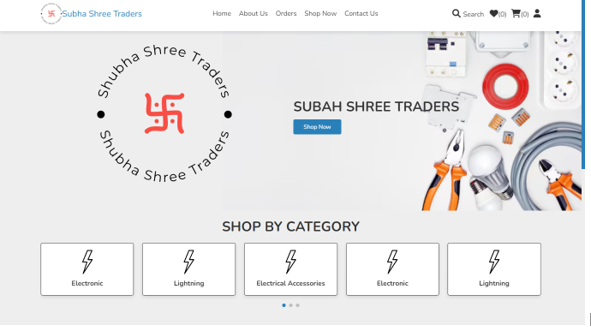
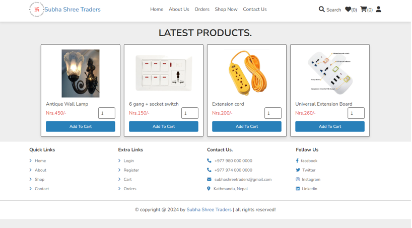
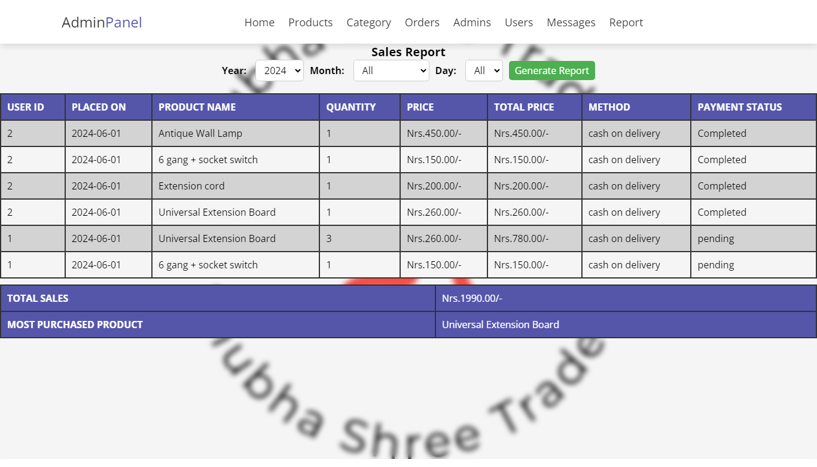
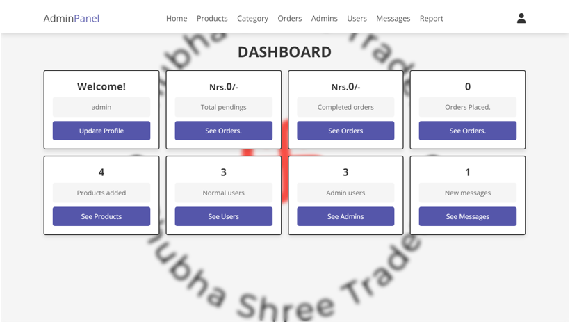

# **Subha Shree Traders**

## **Description**
Subha Shree Traders is an e-commerce site developed as a summer project while being a BIM student. The site offers a platform for users to browse and purchase various products. It includes features such as user registration, product management, and order processing.

## **Technologies Used**
- **Frontend:** HTML, CSS, JavaScript, Bootstrap
- **Backend:** Java
- **Database:** MySQL

## **Features**
- User registration and authentication
- Product browsing and searching
- Shopping cart management
- Order processing and history
- Admin panel for product and order management

## **Installation**

1. Clone the repository:
   ```bash
   git clone [repository-url]
   ```
2. Navigate to the project directory:
    ```bash
   cd [project-directory]
    ```
3. Set up the database:

- Start XAMPP and ensure the MySQL server is running.
- Open phpMyAdmin by navigating to http://localhost/phpmyadmin in your browser.
- Create a new database named [shop_db].
- Import the [shop_db.sql](shop_db.sql) file into the newly created database. You can do this through phpMyAdmin by selecting the database and using the Import feature to upload shop_db.sql.
- Run XAMPP server to host locally
4. Run the program

## Screenshots









## Contributing
Contributions are welcome! Please fork the repository and submit a pull request with your changes. For major changes, please open an issue first to discuss what you would like to change.

## Contact
For questions or feedback, please reach out to:

Email: [aayushstha20@gmail.com]

LinkedIn: [www.linkedin.com/in/aayush-shrestha-b56573211]

